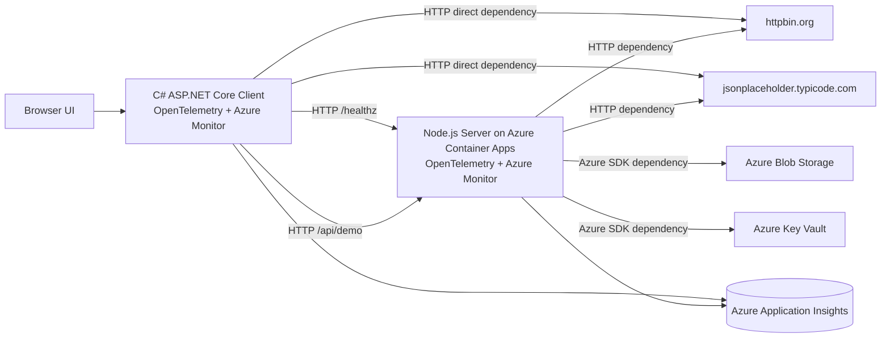

# Azure Application Insights + OpenTelemetry Demo Architecture

## 目标

这个 demo 的目标是展示一套基于 OpenTelemetry 的端到端观测方案：

- client 使用 C# / ASP.NET Core
- server 使用 Node.js / Express
- server 部署在 Azure Container Apps
- client 通过 HTTP 调用 server
- client 和 server 的 telemetry 都进入同一个 Azure Application Insights
- 在 Application Map、Transaction Search、Logs 里看到完整的 request、dependency、trace、exception 和 metric

## 架构图



## 组件职责

### Client

client 是一个 ASP.NET Core Web 应用，既承载 demo UI，也承担“主动制造遥测链路”的职责。

当前 client 主要有两类接口：

- 基础链路：`/api/demo`、`/api/demo/failure`
- 富链路：`/api/demo/rich`、`/api/demo/rich/failure`

富链路会在一次请求里主动触发多个下游依赖：

1. 调用 server 的 `/healthz`
2. 调用 server 的 `/api/demo`
3. 直接调用 `httpbin.org`
4. 直接调用 `jsonplaceholder.typicode.com`
5. 在失败场景里额外触发 server 失败调用和外部 503 调用

这样做的目标是让 client 自己也产生足够丰富的 dependency 数据，而不是只在 Application Map 上看到一条 `client -> server`。

实现入口：

- OpenTelemetry 初始化：`client/Program.cs`
- client -> server 调用：`ServerDemoClient`
- client -> 外部服务调用：`ExternalProbeClient`
- 富链路编排：`ClientWorkflowService`

### Server

server 是一个 Node.js / Express 服务，部署在 Azure Container Apps 中，负责把一条 client 调用继续扩展为更多下游依赖。

server 的 `/api/demo` 在一次请求中会触发：

1. 对 `httpbin.org` 的 HTTP 调用
2. 对 `jsonplaceholder.typicode.com` 的 HTTP 调用
3. 对 Azure Blob Storage 的 SDK 调用
4. 对 Azure Key Vault 的 SDK 调用

在失败路径下，server 会故意抛出异常，用来生成 failed request、failed dependency 和 exception telemetry。

实现入口：

- telemetry 初始化：`server/src/telemetry.js`
- demo 请求编排：`server/src/index.js`

### Azure 侧资源

当前部署包含这些关键 Azure 资源：

- Application Insights
- Log Analytics Workspace
- Azure Container Apps Environment
- Azure Container App
- Azure Container Registry
- Azure Blob Storage
- Azure Key Vault

基础设施模板：

- 平台资源：`infra/platform.bicep`
- server 部署：`infra/server.bicep`

## Client/Server 如何实现关联

这部分是整个方案最关键的技术点。

### 1. 两端都使用 OpenTelemetry + Azure Monitor Distro

client 使用 .NET 侧 Azure Monitor OpenTelemetry Distro：

- `Azure.Monitor.OpenTelemetry.AspNetCore`
- 通过 `AddOpenTelemetry().UseAzureMonitor()` 初始化

server 使用 Node.js 侧 Azure Monitor OpenTelemetry Distro：

- `@azure/monitor-opentelemetry`
- 通过 `useAzureMonitor()` 初始化

这样两端都会使用 OpenTelemetry 语义和 Azure Monitor 的数据映射方式，把请求、依赖、异常、日志和指标统一送到 Application Insights。

### 2. client 通过 HttpClient 自动传播 trace context

client 调用 server 时，使用的是 `HttpClient`。

因为 ASP.NET Core 和 OpenTelemetry 的 HTTP instrumentation 已经启用，所以 client 发起出站 HTTP 请求时会自动注入 W3C Trace Context 头：

- `traceparent`
- `tracestate`

这意味着 client 当前请求里的 trace/span 上下文会被带到 server。

### 3. server 自动接收 trace context 并挂到同一条 trace 上

server 端启用了 Node.js 的 HTTP instrumentation。Express 收到请求时，OpenTelemetry 会自动读取 `traceparent` / `tracestate`，并把这次入站请求挂到已有 trace 上。

结果就是：

- client 的出站 dependency span
- server 的入站 request span

会共享同一个 trace id，并形成父子关系。

这正是 Application Map 和 End-to-End Transaction 能把 `zava-demo-client -> zava-demo-server` 自动串起来的基础。

### 4. server 再向下游继续传播 context

server 内部继续调用 HTTP 服务和 Azure SDK 时，Node.js OpenTelemetry instrumentation 也会继续传播上下文。

因此会形成这样的链路：

`Browser -> Client Request -> Client Dependency -> Server Request -> Server Dependencies`

在同一个 operation / trace 里，你可以继续看到：

- `server -> httpbin.org`
- `server -> jsonplaceholder.typicode.com`
- `server -> Blob Storage`
- `server -> Key Vault`

### 5. client 直接访问外部服务，补足 client 自身链路

为了让 client 侧数据更丰富，当前 client 还直接调用：

- `https://httpbin.org/uuid`
- `https://jsonplaceholder.typicode.com/todos/2`
- `https://httpbin.org/status/503`

这样 Application Map 上不仅有 `client -> server`，还会有：

- `client -> httpbin.org`
- `client -> jsonplaceholder.typicode.com`

失败场景还会产生 client 自己的 failed dependency。

### 6. 使用不同的 service name，让 Application Map 正确分角色显示

如果多个服务把数据送到同一个 Application Insights 资源，但没有区分 cloud role，Application Map 可能会把它们错误地合并。

当前方案通过 `OTEL_SERVICE_NAME` 明确区分角色：

- client: `zava-demo-client`
- server: `zava-demo-server`

Azure Monitor 会把 OpenTelemetry resource 中的 service 信息映射到 Application Insights 的 role 概念里，因此 Application Map 能把 client 和 server 作为两个节点显示。

### 7. 两端发送到同一个 Application Insights 资源

client 和 server 使用同一个 `APPLICATIONINSIGHTS_CONNECTION_STRING`。

这保证了：

- 所有 telemetry 会进入同一个观察面
- Application Map 可以在一个图里拼出整条链路
- Transaction Search / KQL 查询可以直接跨 client 和 server 联查

如果两端发往不同的 Application Insights 资源，即使 trace id 逻辑上有关联，也不能在同一个 Application Map 里自然拼接。

## 当前实现中的关键技术点

### Client 侧

1. 使用 `ActivitySource` 产生自定义 span
2. 使用 `Meter` 产生自定义 metric
3. 使用 `HttpClient` 触发自动 dependency instrumentation
4. 用富链路 workflow 一次请求制造多个关联 dependency
5. 对受控失败记录 exception event 和 failed dependency

### Server 侧

1. `useAzureMonitor()` 在应用入口最早阶段初始化
2. Express 入站请求自动生成 request telemetry
3. `axios` HTTP 请求自动生成 dependency telemetry
4. Azure SDK 自动生成 Blob / Key Vault dependency telemetry
5. `server.orchestrate-demo` span 用于补充业务语义

### 部署侧

1. server 运行在 Azure Container Apps
2. 通过 Azure Container Registry 提供镜像
3. 通过系统身份访问 Blob 和 Key Vault
4. 通过同一份 Application Insights connection string 汇聚 telemetry

## 典型链路示意

### 成功场景

```text
Browser
  -> Client /api/demo/rich
    -> Client /healthz dependency -> Server /healthz
    -> Client /api/demo dependency -> Server /api/demo
      -> Server dependency -> httpbin.org
      -> Server dependency -> jsonplaceholder.typicode.com
      -> Server dependency -> Azure Blob Storage
      -> Server dependency -> Azure Key Vault
    -> Client direct dependency -> httpbin.org
    -> Client direct dependency -> jsonplaceholder.typicode.com
```

### 失败场景

```text
Browser
  -> Client /api/demo/rich/failure
    -> Client dependency -> Server /api/demo?simulateFailure=true
      -> Server request failed
    -> Client direct dependency -> httpbin.org/status/503
      -> Client dependency failed
```

## 在 Azure 中预期看到什么

### Application Map

通常可以看到这些节点：

- `zava-demo-client`
- `zava-demo-server`
- `httpbin.org`
- `jsonplaceholder.typicode.com`
- `Azure Blob Storage`
- `Azure Key Vault`

### Transaction Search

建议重点查看这些 operation 名称：

- `client.run-rich-demo`
- `client.run-rich-demo-failure`
- `client.workflow.orchestrate`
- `client.run-demo`
- `client.run-demo-failure`
- `server.orchestrate-demo`

### Metrics / Logs

client 侧当前自定义 metric：

- `client.demo.requests`
- `client.demo.workflows`
- `client.demo.dependencies`
- `client.demo.server_latency`
- `client.demo.dependency_latency`
- `client.demo.workflow_latency`

server 侧当前自定义 metric：

- `server.demo.requests`
- `server.demo.duration`

## 为什么这种实现能稳定展示关联

核心原因只有三点：

1. 两端都启用了 OpenTelemetry 自动 instrumentation
2. client -> server 的 HTTP 调用自动传播 W3C trace context
3. 两端都把 telemetry 发送到同一个 Application Insights，并使用不同 service name 区分角色

这三点成立后，Application Insights 就能把单点数据还原成一条完整的分布式调用链。

## 后续可扩展方向

如果还想让图更丰富，可以继续加这些下游依赖：

- Azure Service Bus
- Azure Cosmos DB
- Azure Redis
- Azure SQL Database
- 让 client 也直接访问 Azure SDK 资源

这样可以进一步扩大 Application Map 的广度和层次。