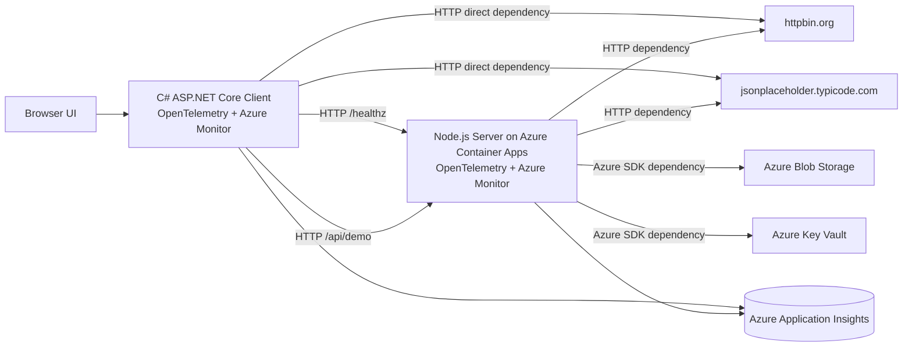

# Azure Application Insights + OpenTelemetry Demo Architecture

## Objective

The goal of this demo is to show an end-to-end observability solution built with OpenTelemetry:

- the client uses C# and ASP.NET Core
- the server uses Node.js and Express
- the server is deployed to Azure Container Apps
- the client calls the server over HTTP
- both client and server send telemetry to the same Azure Application Insights resource
- the full request, dependency, trace, exception, and metric path can be inspected in Application Map, Transaction Search, and Logs

## Architecture Diagram



## Component Responsibilities

### Client

The client is an ASP.NET Core web application. It serves the demo UI and also actively generates richer telemetry chains.

The client currently exposes two categories of endpoints:

- base flow endpoints: `/api/demo`, `/api/demo/failure`
- rich flow endpoints: `/api/demo/rich`, `/api/demo/rich/failure`

The rich flow triggers multiple downstream dependencies during a single request:

1. call the server `/healthz` endpoint
2. call the server `/api/demo` endpoint
3. call `httpbin.org` directly
4. call `jsonplaceholder.typicode.com` directly
5. in failure mode, trigger both a server failure and an external 503 dependency

The purpose is to make the client itself produce enough dependency telemetry instead of showing only a single `client -> server` edge in Application Map.

Implementation entry points:

- OpenTelemetry initialization: `client/Program.cs`
- client to server calls: `ServerDemoClient`
- client to external services: `ExternalProbeClient`
- rich workflow orchestration: `ClientWorkflowService`

### Server

The server is a Node.js and Express service running on Azure Container Apps. It expands one client request into multiple downstream dependencies.

During a single `/api/demo` request, the server triggers:

1. an HTTP call to `httpbin.org`
2. an HTTP call to `jsonplaceholder.typicode.com`
3. an Azure Blob Storage SDK call
4. an Azure Key Vault SDK call

In the failure path, the server intentionally throws an error to generate failed request, failed dependency, and exception telemetry.

Implementation entry points:

- telemetry bootstrap: `server/src/telemetry.js`
- demo request orchestration: `server/src/index.js`

### Azure Resources

The deployment currently includes these main Azure resources:

- Application Insights
- Log Analytics Workspace
- Azure Container Apps Environment
- Azure Container App
- Azure Container Registry
- Azure Blob Storage
- Azure Key Vault

Infrastructure templates:

- platform resources: `infra/platform.bicep`
- server deployment: `infra/server.bicep`

## How Client and Server Correlation Works

This is the most important technical part of the solution.

### 1. Both Sides Use OpenTelemetry with Azure Monitor Distros

The client uses the .NET Azure Monitor OpenTelemetry distro:

- `Azure.Monitor.OpenTelemetry.AspNetCore`
- initialized through `AddOpenTelemetry().UseAzureMonitor()`

The server uses the Node.js Azure Monitor OpenTelemetry distro:

- `@azure/monitor-opentelemetry`
- initialized through `useAzureMonitor()`

As a result, both sides use OpenTelemetry semantics and Azure Monitor mappings to send requests, dependencies, exceptions, logs, and metrics into Application Insights.

### 2. The Client Automatically Propagates Trace Context Through HttpClient

The client uses `HttpClient` to call the server.

Because ASP.NET Core and OpenTelemetry HTTP instrumentation are enabled, outbound HTTP requests automatically include W3C Trace Context headers:

- `traceparent`
- `tracestate`

This means the current trace and span context from the client request is sent to the server.

### 3. The Server Automatically Accepts Trace Context and Joins the Same Trace

The server enables Node.js HTTP instrumentation. When Express receives a request, OpenTelemetry automatically reads `traceparent` and `tracestate`, then attaches the inbound request to the existing trace.

The result is:

- the client outbound dependency span
- the server inbound request span

share the same trace id and form a parent-child relationship.

That is the foundation that allows Application Map and end-to-end transaction views to automatically connect `zava-demo-client -> zava-demo-server`.

### 4. The Server Continues Context Propagation to Downstream Dependencies

When the server calls HTTP services and Azure SDK dependencies, Node.js OpenTelemetry instrumentation continues to propagate context.

That forms this chain:

`Browser -> Client Request -> Client Dependency -> Server Request -> Server Dependencies`

Within the same operation or trace, you can continue to see:

- `server -> httpbin.org`
- `server -> jsonplaceholder.typicode.com`
- `server -> Blob Storage`
- `server -> Key Vault`

### 5. The Client Calls External Services Directly to Enrich Client-Side Topology

To make the client topology richer, the client also directly calls:

- `https://httpbin.org/uuid`
- `https://jsonplaceholder.typicode.com/todos/2`
- `https://httpbin.org/status/503`

This adds not only `client -> server` but also:

- `client -> httpbin.org`
- `client -> jsonplaceholder.typicode.com`

The failure scenario also generates failed client-side dependency telemetry.

### 6. Distinct Service Names Keep Application Map Roles Separate

If multiple services send telemetry into the same Application Insights resource without distinguishing their role identity, Application Map can merge them incorrectly.

The current solution uses `OTEL_SERVICE_NAME` to keep roles separate:

- client: `zava-demo-client`
- server: `zava-demo-server`

Azure Monitor maps OpenTelemetry service metadata into Application Insights role concepts, so the client and server appear as separate nodes.

### 7. Both Sides Send Telemetry to the Same Application Insights Resource

The client and server use the same `APPLICATIONINSIGHTS_CONNECTION_STRING`.

This guarantees that:

- all telemetry lands in the same observability surface
- Application Map can reconstruct the entire chain in one graph
- Transaction Search and KQL queries can correlate across client and server directly

If the two services sent data to different Application Insights resources, trace ids might still be logically related, but the topology would not naturally assemble in one Application Map.

## Key Technical Elements in the Current Implementation

### Client Side

1. custom spans are produced with `ActivitySource`
2. custom metrics are produced with `Meter`
3. `HttpClient` triggers automatic dependency instrumentation
4. the rich workflow creates multiple correlated dependencies within a single request
5. controlled failures produce exception events and failed dependencies

### Server Side

1. `useAzureMonitor()` is initialized at the earliest application startup stage
2. Express inbound requests automatically generate request telemetry
3. `axios` HTTP calls automatically generate dependency telemetry
4. Azure SDK calls automatically generate Blob and Key Vault dependency telemetry
5. `server.orchestrate-demo` adds business semantics to the trace

### Deployment Side

1. the server runs on Azure Container Apps
2. Azure Container Registry provides the container image
3. managed identity is used for Blob Storage and Key Vault access
4. the same Application Insights connection string aggregates telemetry from both sides

## Example Call Paths

### Success Scenario

```text
Browser
  -> Client /api/demo/rich
    -> Client /healthz dependency -> Server /healthz
    -> Client /api/demo dependency -> Server /api/demo
      -> Server dependency -> httpbin.org
      -> Server dependency -> jsonplaceholder.typicode.com
      -> Server dependency -> Azure Blob Storage
      -> Server dependency -> Azure Key Vault
    -> Client direct dependency -> httpbin.org
    -> Client direct dependency -> jsonplaceholder.typicode.com
```

### Failure Scenario

```text
Browser
  -> Client /api/demo/rich/failure
    -> Client dependency -> Server /api/demo?simulateFailure=true
      -> Server request failed
    -> Client direct dependency -> httpbin.org/status/503
      -> Client dependency failed
```

## What You Should Expect in Azure

### Application Map

You should typically see these nodes:

- `zava-demo-client`
- `zava-demo-server`
- `httpbin.org`
- `jsonplaceholder.typicode.com`
- `Azure Blob Storage`
- `Azure Key Vault`

### Transaction Search

Recommended operation names to inspect:

- `client.run-rich-demo`
- `client.run-rich-demo-failure`
- `client.workflow.orchestrate`
- `client.run-demo`
- `client.run-demo-failure`
- `server.orchestrate-demo`

### Metrics and Logs

Current client custom metrics:

- `client.demo.requests`
- `client.demo.workflows`
- `client.demo.dependencies`
- `client.demo.server_latency`
- `client.demo.dependency_latency`
- `client.demo.workflow_latency`

Current server custom metrics:

- `server.demo.requests`
- `server.demo.duration`

## Why This Design Produces Stable Correlation

There are only three core reasons:

1. both sides enable automatic OpenTelemetry instrumentation
2. client to server HTTP calls automatically propagate W3C trace context
3. both sides send telemetry to the same Application Insights resource while using distinct service names

Once these three conditions are true, Application Insights can reconstruct a complete distributed call chain from individual telemetry items.

## Future Expansion Options

If you want a richer graph, you can add more downstream dependencies such as:

- Azure Service Bus
- Azure Cosmos DB
- Azure Redis
- Azure SQL Database
- direct Azure SDK calls from the client side as well

That will further expand both the breadth and depth of Application Map.
