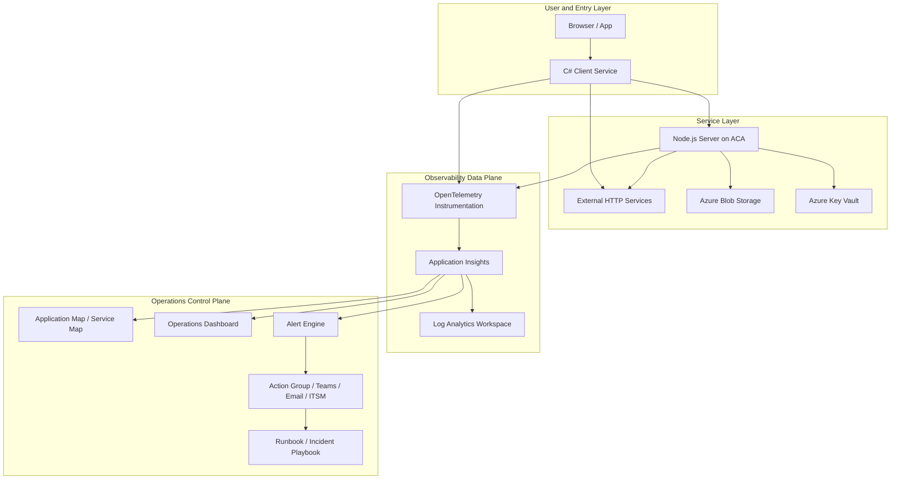

# End-to-End Tracing Operations Design

## Positioning

This document is not written from a developer instrumentation perspective. It is written from the perspective of operations, SRE, and platform architecture to define a sustainable end-to-end tracing system.

The core goal is not simply to emit traces. The goal is to give operations teams the ability to:

- detect issues in real time
- proactively notify the right people
- understand blast radius quickly through a friendly interface
- identify root cause fast
- unify traces, metrics, logs, and events into a single response loop
- establish a standardized, repeatable, production-grade operating model

## Overall Objectives

For the current client/server demo, the operational target should be elevated into five layers:

1. Observable: all critical call paths can be collected, correlated, and queried.
2. Detectable: anomalies can be discovered automatically within seconds or minutes.
3. Actionable: alerts reach the correct on-call engineer with enough context.
4. Diagnosable: responders can jump directly to impacted services, dependencies, versions, regions, and sample requests.
5. Operable: long-term governance is driven by SLOs, alerting policy, on-call workflows, and capacity trends.

## Architecture Principles

### 1. Unified Signal Model

Use OpenTelemetry as the standard telemetry model and unify the following signal types:

- traces
- metrics
- logs
- exceptions
- events

The value of this approach is:

- different languages and frameworks share the same resource model
- client, server, and infrastructure dependencies can be correlated using the same key fields
- more services can be added later without creating observability silos

### 2. Use the Call Chain as the Primary Operational Unit

Traditional operations focuses on a single machine, process, or service. In distributed systems, however, many failures happen in the chain between services.

The operational backbone should therefore answer:

- which services a user request passed through
- which hop became slow
- which dependency failed
- which version or region introduced the issue
- how many real business paths are impacted

### 3. Evolve from Monitoring Panels to an Incident Handling System

A mature operations design should not stop at dashboards. It must support the full response loop:

- detection
- diagnosis
- notification
- collaboration
- recovery
- post-incident review

## High-Level Architecture

## Layered Design from an Operations Perspective

### Layer 1: Collection Layer

Goal: collect business call chains completely, consistently, and with low loss.

Design requirements:

- client and server must both use OpenTelemetry
- all inbound and outbound HTTP calls must be instrumented automatically
- all critical business steps should have custom spans
- all critical dependencies must emit dependency telemetry
- critical exceptions must become exception telemetry automatically
- key business indicators must exist as metrics rather than relying on traces alone

What already exists in this demo:

- client request, dependency, workflow trace, exception, and metric telemetry
- server request, dependency, Azure SDK dependency, trace, exception, and metric telemetry

Recommended next additions:

- resource tags for deployment ring, environment, region, tenant, and build version
- user journey fields such as journey, scenario, or business operation
- key business result codes such as orderStatus, paymentResult, or riskDecision

### Layer 2: Correlation Layer

Goal: turn separate signals into one complete business path.

This is the most important layer in the entire design.

Design requirements:

- all services must use W3C Trace Context
- service naming must follow a unified convention
- resource attributes must follow a unified convention
- each span must clearly identify service, environment, version, and region
- requests, dependencies, logs, and exceptions must all be navigable through trace id or operation id

Recommended resource tag standards:

- `service.name`
- `service.namespace`
- `service.instance.id`
- `deployment.environment`
- `cloud.region`
- `service.version`
- `tenant.id` or `customer.segment`
- `business.scenario`

This layer should allow operators to answer:

- which service failed first
- which version introduced the issue
- which region is impacted
- whether the problem is at the entry point, in a dependency, or inside internal processing

### Layer 3: Analysis Layer

Goal: transform high-volume telemetry into operational decisions.

This layer should be based on three primary analysis models:

1. RED model

- Rate: request volume
- Errors: error rate
- Duration: latency

2. Four golden signals

- latency
- traffic
- errors
- saturation

3. Dependency health model

- dependency success rate
- dependency latency
- dependency request volume
- dependency fault propagation radius

For the current demo, recommended key dimensions are:

- client entry request success rate
- client-to-server call latency
- client direct dependency success rate
- server dependency success rate for Blob and Key Vault
- the most common dependency targets in failed requests

### Layer 4: Alerting Layer

Goal: detect issues immediately and alert with context, without creating noise.

Alert design must avoid two common failures:

- threshold-only alerts on isolated metrics, which create noise
- context-free alerts, which force the receiver to start investigation from scratch

Recommended alert categories:

1. Real-time symptom alerts

- request error rate spikes
- abnormal increase in P95 or P99 latency
- dependency success rate falls below threshold
- concentrated failure in a region or revision

2. Business impact alerts

- critical business path failure rate exceeds threshold
- transaction success rate drops for a user cohort
- visible degradation for a tenant or a geography

3. Change-correlated alerts

- error rate spikes within 10 minutes after a new revision goes live
- dependency latency rises significantly after release
- anomaly clusters increase for the same trace pattern after deployment

Recommended modern practices:

- use multi-signal alerting instead of single-metric alerting
- attach affected trace samples from the last 15 minutes to the alert
- attach the impacted service topology and recent release version
- attach an automatically generated suspected root cause summary
- suppress short-lived noise using burn-rate logic or window aggregation

## Proactive Notification Design

### Notification Objective

Notification is not just sending a message. It is routing the problem accurately to the people most capable of fixing it.

Recommended routing model:

- P1 or P2: Teams, SMS, and phone escalation
- P3: Teams and email
- platform issues: notify the platform team
- business issues: notify the service owner
- dependency issues: notify both the dependency owner and the calling service owner

### Minimum Useful Alert Payload

Each alert should include at least:

- severity level
- impacted service
- impacted region
- current error rate or latency value
- impacted dependency node
- latest revision or version
- sample entry request
- direct link to Application Map
- direct link to Transaction Search
- direct link to the relevant runbook

### Alert Noise Reduction Strategy

Recommended industry practices:

- group alerts with the same root cause into one incident
- limit repeat notification volume for the same service within the same window
- use dependency topology to distinguish primary alerts from secondary alerts
- when a downstream dependency fails, avoid escalating every upstream symptom as a separate P1 incident

## Friendly Interface Design

Operators do not need more charts. They need less cognitive load.

The interface should be structured into four levels.

### 1. On-Call Overview Page

Audience: NOC and primary on-call.

Display:

- active P1 or P2 incidents
- impacted business paths
- impacted regions
- top failing services
- top failing dependencies
- current burn rate
- release changes in the last 30 minutes

### 2. Service Topology Page

Audience: service owners and SREs.

Display:

- service call topology
- success rate, QPS, and P95 latency for each edge
- highlighted abnormal nodes
- recent version change markers
- filters for region, environment, and version

### 3. Transaction Trace Page

Audience: incident responders.

Display:

- a single trace waterfall
- duration and status of each span
- target, protocol, and result code for each dependency
- aggregated logs and exceptions under the same trace
- related deployment version, instance, and region

### 4. Root Cause Analysis Page

Audience: advanced operations and platform teams.

Display:

- first appearance time of the issue
- relationship to recent releases or config changes
- which service showed anomalies first
- whether the issue is concentrated on a dependency, tenant, region, or instance
- clustering results for similar trace patterns

## Standard Process for Fast Problem Isolation

A mature operations design must standardize the troubleshooting workflow.

Recommended sequence:

### Step 1: Determine Blast Radius

Answer first:

- is the issue local or global
- is it single-region or multi-region
- is it tenant-specific or affecting all users
- is it confined to one function or an entire business domain

### Step 2: Determine the Fault Location

Use Application Map and dependency health to decide whether the issue is in:

- the client entry layer
- the server itself
- an external HTTP dependency
- an Azure resource dependency

### Step 3: Jump to Representative Transactions

Select representative failed and slow traces and examine:

- which span is slowest
- which dependency fails first
- whether there is a retry storm
- whether anomalies are concentrated on a specific version

### Step 4: Correlate with Logs and Change History

Confirm:

- whether a new version was recently deployed
- whether connection strings, permissions, routes, or throttling policies were changed
- whether failures are concentrated on a revision or instance

### Step 5: Execute the Runbook

Jump directly into the matching playbook for:

- dependency outage
- error rate spike
- latency spike
- permission failure
- capacity exhaustion
- regional failure

## Target State Based on the Current Demo

The current demo is already a strong minimum viable reference, but it can be evolved into a production-grade operational target state.

### Existing Capabilities

- client and server traces are already correlated
- client, server, external dependencies, and Azure dependencies already flow into the same Application Insights instance
- multi-hop dependencies are already visible in Application Map
- baseline exception and metric data already exist

### Recommended Enhancements

1. Add unified tag governance

- environment
- region
- version
- deployment ring
- scenario
- tenant

2. Add operations dashboards

- service health overview
- dependency health overview
- release health dashboard
- top issue hotspots

3. Add layered alerting

- P1: critical path unavailable
- P2: critical path materially degraded
- P3: non-critical dependency abnormal
- P4: trend-based early warning

4. Add automated response

- auto-create incidents
- auto-start a war room
- auto-attach recent failed traces
- auto-correlate recent deployment records

5. Add an SLO model

- client entry success-rate SLO
- client-to-server latency SLO
- server core API success-rate SLO
- key dependency success-rate SLO

## Recommended Data Model

To support operations and troubleshooting, standardize the following fields:

- `service.name`
- `service.version`
- `deployment.environment`
- `cloud.region`
- `enduser.id` or an anonymous user identifier
- `operation.name`
- `business.scenario`
- `dependency.target`
- `dependency.type`
- `error.type`
- `error.code`
- `release.id`
- `incident.correlation.id`

These fields directly determine whether alerts can be routed correctly, dashboards can be segmented properly, and root causes can be clustered quickly.

## Recommended Advanced Practices

Based on mature industry patterns, the following principles are recommended.

### 1. Use Metrics for Detection and Traces for Diagnosis

Metrics are for fast detection. Traces are for precise diagnosis. Logs provide supporting detail.

Do not try to solve every operational problem using only one signal type.

### 2. Drive Alerting with SLOs and Error Budgets

Do not rely only on static thresholds. A better approach is to:

- define SLOs around critical business paths
- use burn-rate alerting to measure error-budget consumption speed
- tie alerts to real business impact

### 3. Strongly Correlate with Change Events

A large portion of production incidents is change-related. The observability platform should therefore ingest:

- release version
- deployment time
- revision id
- configuration changes
- feature flag changes

### 4. Build a Strong Sampling Strategy

For high-volume systems, use combined sampling:

- proportional sampling for normal requests
- full retention for failed requests
- full retention for slow requests
- full retention for selected critical transactions

This controls cost without weakening incident diagnosis.

### 5. Optimize for the On-Call Experience

The most advanced practice is not a more complex dashboard. It is lower MTTR.

Design should therefore optimize for:

- understanding what is happening at a glance
- jumping to the most relevant trace in one click
- seeing impacted dependencies and recent changes in one click
- opening the correct runbook in one click

## Recommended Rollout Plan

### Phase 1: Establish Basic Trace Connectivity

- standardize OpenTelemetry integration
- connect client and server trace correlation
- establish the baseline Application Map

### Phase 2: Build Operations Views

- build dashboards
- build service and dependency scorecards
- define standard queries and standard incident entry points

### Phase 3: Build Proactive Alerting

- define SLOs
- define burn-rate alerts
- define dependency health alerts
- define change-correlated alerts

### Phase 4: Build Automated Response

- group alerts automatically
- create incidents automatically
- attach trace evidence automatically
- route responders to the correct runbook automatically

## Conclusion

From an operations architect perspective, the main value of end-to-end tracing is not simply to see every call. The real value is to ensure failures are detected faster, notified more accurately, diagnosed more quickly, and resolved at lower operational cost.

Based on the current demo, the right evolution path is to:

- keep OpenTelemetry as the common standard
- organize observability around call chains
- organize alerting around SLOs and business impact
- organize the interface around Application Map, trace waterfall, and root cause views
- organize response around incidents, runbooks, change correlation, and automation

That is the path from basic monitoring integration to a production-grade operations system.
