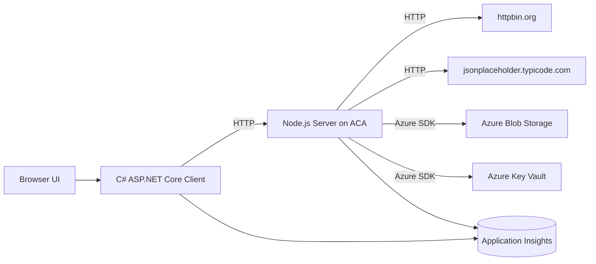
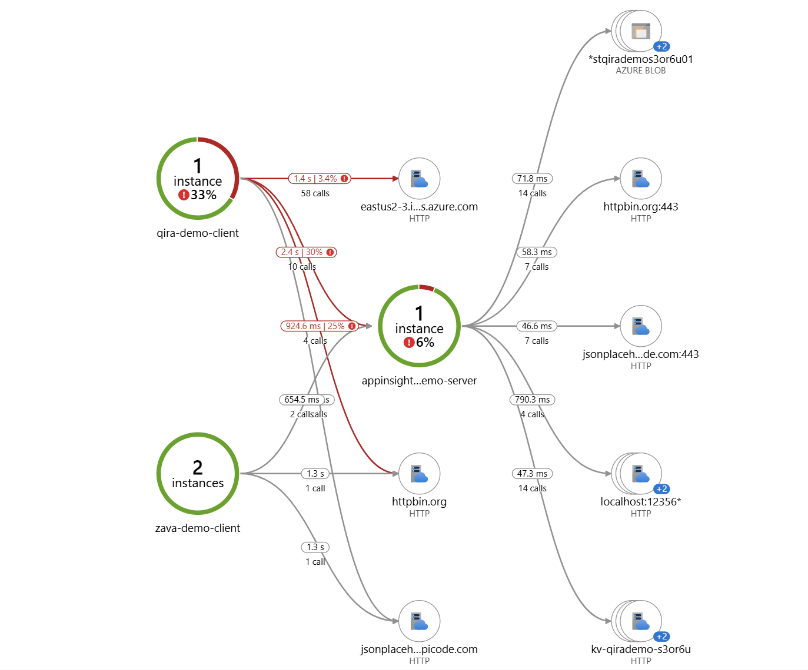
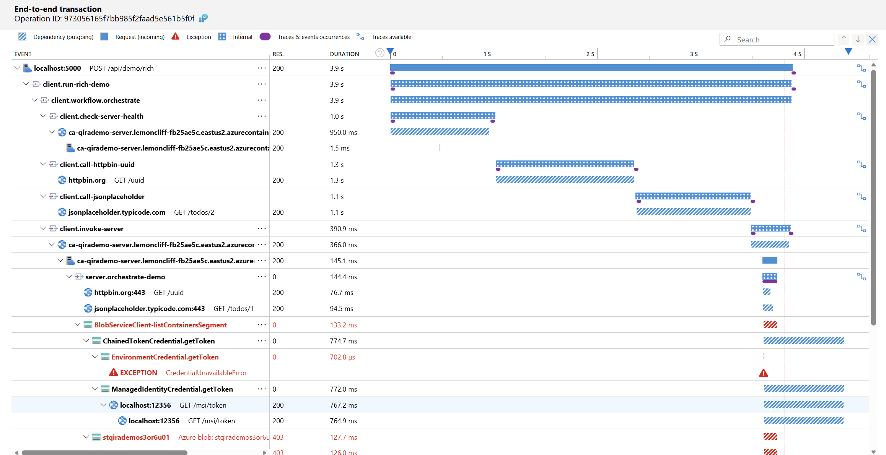

# Azure Application Insights + OpenTelemetry Demo

This repository contains a complete demo that showcases Azure Application Insights monitoring capabilities using OpenTelemetry.

Solution goals:

- the client is built with C# and ASP.NET Core
- the server is built with Node.js and Express, and runs on Azure Container Apps
- the client calls the server over HTTP
- both client and server are instrumented with the Azure Monitor OpenTelemetry distro
- the demo is designed to surface as many useful dependencies as possible in Application Map

## Architecture



## Telemetry Design

The client emits these typical telemetry types:

- incoming requests when users access the client UI or trigger client APIs
- HTTP dependencies when the client calls the server
- direct HTTP dependencies when the client calls `httpbin.org` and `jsonplaceholder.typicode.com`
- exceptions from `/api/boom` and failure scenarios
- traces from custom Activities, workflow spans, and logs
- metrics such as `client.demo.requests`, `client.demo.workflows`, `client.demo.dependencies`, `client.demo.server_latency`, `client.demo.dependency_latency`, and `client.demo.workflow_latency`

The server emits these typical telemetry types:

- incoming requests for Express endpoints such as `/api/demo`
- HTTP dependencies to `httpbin.org` and `jsonplaceholder.typicode.com`
- Azure SDK dependencies to Azure Blob Storage and Azure Key Vault
- exceptions when `simulateFailure=true`
- custom traces such as `server.orchestrate-demo`
- metrics such as `server.demo.requests` and `server.demo.duration`




## Repository Layout

- `client/`: C# ASP.NET Core client
- `server/`: Node.js server
- `infra/`: Azure Bicep templates
- `scripts/`: PowerShell deployment and run scripts

## Prerequisites

- Azure CLI signed in
- .NET 8 SDK
- Node.js 20+
- permission to create these Azure resources in the target subscription:
  - Azure Container Registry
  - Azure Container Apps Environment
  - Azure Container Apps
  - Application Insights
  - Log Analytics Workspace
  - Storage Account
  - Key Vault

## One-Command Server Deployment to Azure

Run this from the repository root:

```powershell
./scripts/deploy-server.ps1 -ResourceGroupName rg-appinsight-zavademo -Location eastus -Prefix zavademo -ImageTag v1
```

The script performs these steps:

1. Deploys the shared platform resources.
2. Creates Application Insights, Log Analytics, the ACA environment, ACR, Storage, and Key Vault.
3. Creates a `demo-config` secret as part of infrastructure deployment.
4. Builds and pushes the Node.js server image to ACR.
5. Deploys the Azure Container App and grants it:
   - `AcrPull`
   - `Storage Blob Data Reader`
   - `Key Vault Secrets User`

After the script completes, it outputs:

- the Application Insights connection string
- the public Azure Container App URL

## Run the Client Locally

Use the connection string and server URL from the previous step:

```powershell
./scripts/run-client.ps1 -AppInsightsConnectionString "<connection-string>" -ServerBaseUrl "https://<server-fqdn>"
```

The default local address is usually:

- `http://localhost:5000`
- or `https://localhost:5001`

For the best demo flow, use this sequence in the UI:

1. Click `Run rich success scenario`.
2. Click `Run rich failure scenario`.
3. Click `Run original success scenario`.
4. Click `Run original failure scenario`.
5. Click `Trigger client exception endpoint`.
6. Wait 2 to 5 minutes, then inspect Application Insights Application Map.

## Expected Application Map Relationships

You should typically see these node relationships:

- `zava-demo-client` -> `zava-demo-server`
- `zava-demo-client` -> `httpbin.org`
- `zava-demo-client` -> `jsonplaceholder.typicode.com`
- `zava-demo-server` -> `httpbin.org`
- `zava-demo-server` -> `jsonplaceholder.typicode.com`
- `zava-demo-server` -> `Azure Blob Storage`
- `zava-demo-server` -> `Azure Key Vault`

Notes:

- if Blob Storage or Key Vault roles were just assigned, RBAC propagation may take a few minutes
- even if an Azure SDK dependency call fails, dependency telemetry will usually still appear in Application Insights

## Recommended Validation Path

### 1. View Application Map

Open the Application Insights resource in the Azure portal and go to Application Map.

### 2. Inspect End-to-End Transactions

In Transaction Search, filter by these operation names:

- `client.run-rich-demo`
- `client.run-rich-demo-failure`
- `client.workflow.orchestrate`
- `client.run-demo`
- `client.run-demo-failure`
- `server.orchestrate-demo`

### 3. Run KQL Queries

View requests:

```kusto
requests
| where timestamp > ago(1h)
| order by timestamp desc
| project timestamp, cloud_RoleName, name, resultCode, success, operation_Id
```

View dependencies:

```kusto
dependencies
| where timestamp > ago(1h)
| order by timestamp desc
| project timestamp, cloud_RoleName, target, type, name, success, operation_Id
```

View exceptions:

```kusto
exceptions
| where timestamp > ago(1h)
| order by timestamp desc
| project timestamp, cloud_RoleName, type, outerMessage, operation_Id
```

View traces:

```kusto
traces
| where timestamp > ago(1h)
| order by timestamp desc
| project timestamp, cloud_RoleName, message, severityLevel, operation_Id
```

## Key Implementation Points

- the client uses `Azure.Monitor.OpenTelemetry.AspNetCore` and sends telemetry with `AddOpenTelemetry().UseAzureMonitor()`
- the server uses `@azure/monitor-opentelemetry` and initializes telemetry at the earliest application startup point
- `OTEL_SERVICE_NAME` distinguishes client and server cloud roles so Application Map does not merge them into one node
- the server deliberately calls two public HTTP endpoints and two Azure resources to increase dependency richness

## Further Extensions

If you want an even richer dependency graph, you can extend the server with additional downstream dependencies such as:

- Azure Service Bus
- Azure Cosmos DB
- Azure Redis
- SQL Database

The current version intentionally stays minimal, runnable, and easy to demo.
